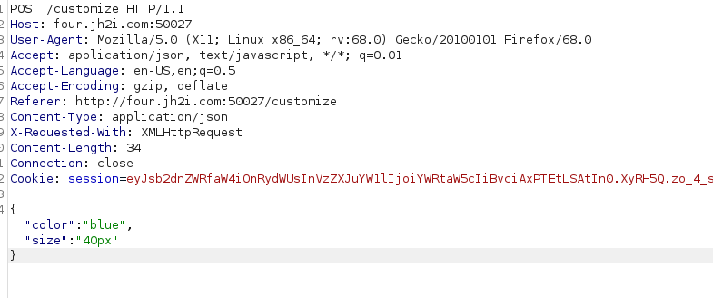
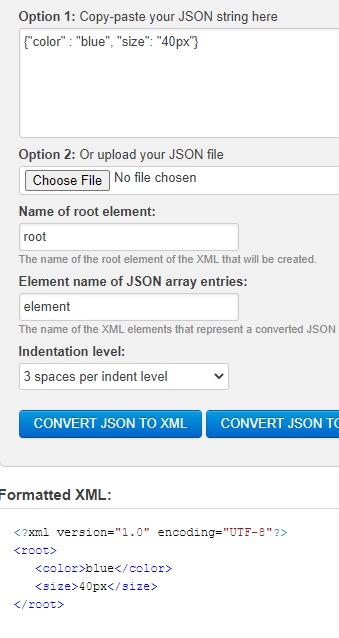
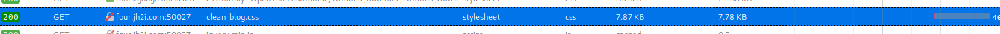
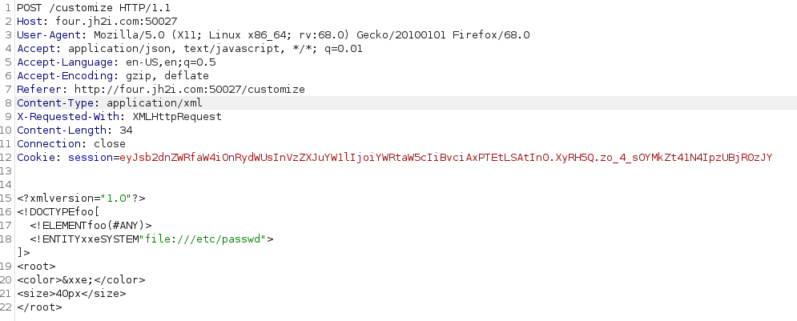
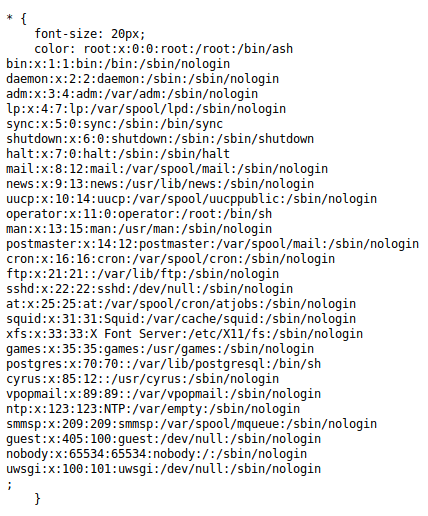
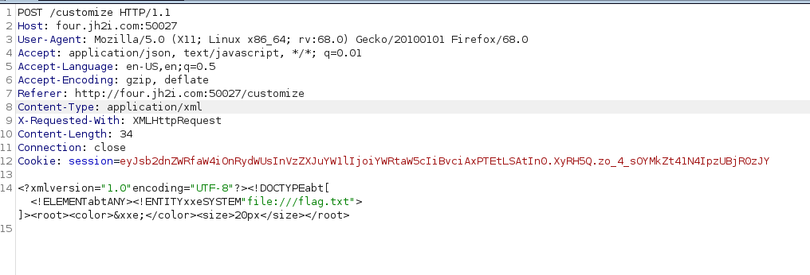
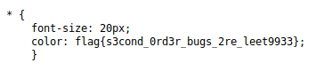

## Writeup Special Order by Ambrotd
looking around the website and with the second order hint from the second order ecuation I was looking around and the only place I find I could do something was in customize

This was the request:

Convert it to xml seems to work

And the result was saved in:

So I tried to pull the /etc/passwd

And we got the responde on the clean-blog.css

So I try with the flag.txt

And I got the flag:

